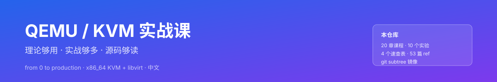

# QEMU/KVM 系统实战课

> 一份从零到生产可用的 QEMU/KVM 学习教程：理论够用、实战够多、源码够读。



## 📖 这是什么

本仓库是一个**自学式 QEMU/KVM 课程**，面向：

- 想理解云上「虚拟机」背后机制的运维 / 后端工程师
- 想读 QEMU 与 Linux KVM 子系统源码的 C 开发者
- 想在生产环境跑稳 KVM、做性能调优与故障排查的 SRE
- 嵌入式 / 内核 / 虚拟化方向的学生与转岗者

**目标**：学完之后，你能独立搭建一套生产可用的 KVM 平台、解释每一层在做什么、写 lab 验证自己的猜想。

## 🎯 学完你能做什么

| 能力 | 验证方式 |
| --- | --- |
| 解释 QEMU 与 KVM 的职责划分 | 课程中动手画出数据流图 + 一句话总结 |
| 30 分钟搭出一台带 VNC 访问的虚拟机 | `labs/lab03-first-vm` |
| 在 5 种网络模式中选最合适的 | `labs/lab05-network-modes` 跑完所有模式 |
| 把宿主 GPU 直通给虚拟机做转码 | `labs/lab07-pci-passthrough` |
| 在线迁移一台运行中的虚拟机 | `labs/lab09-live-migration` |
| 阅读 KVM `vmx` 模块入口源码 | `course/17-KVM源码导读` |

## 🧭 课程结构

```
课程
├── 00 课程介绍与学习方法
├── 01 虚拟化基础理论
├── 02 硬件虚拟化（Intel VT-x / AMD-V）
├── 03 环境搭建实战  ←— 第一个动手章节
├── 04 QEMU 基础与命令行
├── 05 第一个虚拟机实战  ←— 跑起来第一台 VM
├── 06 KVM 内核工作原理
├── 07 存储虚拟化详解（image format / 共享存储）
├── 08 网络虚拟化详解（5 种模式对比）
├── 09 设备虚拟化与 virtio
├── 10 图形与显示方案对比（VNC / SPICE / GPU）
├── 11 libvirt 管理实战
├── 12 性能调优与诊断
├── 13 实时迁移与高可用
├── 14 安全与隔离（sVirt / cgroup）
├── 15 跨架构模拟实战（ARM/MIPS）
├── 16 QEMU 源码导读
├── 17 KVM 源码导读
├── 18 与容器 / 云原生的取舍
├── 19 常见故障排查
└── 99 附录与速查表
```

每个章节格式：

1. **学习目标** —— 5 分钟看完知道自己要学啥
2. **理论要点** —— 讲清楚是什么、为什么
3. **优劣对比** —— 每种方案讲生产环境的取舍
4. **实战操作** —— 真实命令、真实输出、真实失败
5. **小结** —— 一张图或一段话总结
6. **思考题** —— 主动回忆
7. **参考资料** —— 指向 `refs/learn-kvm/` 原始材料

## 🧪 实验环境

- 操作系统：Ubuntu 22.04 / Debian 12 / RHEL 9 / openEuler 22.03 任一
- 内存：≥ 8 GB（要跑嵌套虚拟化建议 16 GB）
- CPU：必须支持 Intel VT-x 或 AMD-V，且 BIOS 中开启
- 实验脚本全部使用 bash + qemu-kvm + libvirt，可在真机或二层虚机中跑

> 跑 KVM 必须有硬件虚拟化支持。  
> 「如何在二层虚机里跑 KVM」见 `labs/lab01-check-vt-support.md`。

## 🚀 快速开始

```bash
# 1. 克隆（含子仓库 reference）
git clone https://github.com/yourname/learn-qemu-kvm.git
cd learn-qemu-kvm

# 2. 检查 CPU 是否支持虚拟化
bash labs/scripts/check-vt.sh

# 3. 安装 QEMU + KVM + libvirt
bash labs/scripts/install-qemu.sh

# 4. 验证环境（期望看到「环境就绪」）
bash labs/scripts/verify-install.sh

# 5. 跑起第一台 VM（自动选 KVM，无 KVM 回退 TCG）
bash labs/scripts/start-vm.sh
```

## 📚 参考资料

课程将 `yifengyou/learn-kvm` 的全部 53 个 markdown 文档作为参考底料收录在
[`refs/learn-kvm/`](refs/learn-kvm/)，并通过 git subtree 管理，可单独同步：

```bash
# 拉取上游最新内容
git subtree pull --prefix=refs/learn-kvm https://github.com/yifengyou/learn-kvm.git master --squash

# 把本地改动推回上游（一般不会做，仅记录）
git subtree push --prefix=refs/learn-kvm https://github.com/yifengyou/learn-kvm.git master
```

> 为什么用 subtree 而不是 submodule？  
> subtree 把外部仓库当作本地目录，clone 一次就能用，不需要 `git submodule update`；
> 缺点是合并历史会变 squash commit，但作为参考资料这正好合适。

每个章节末尾的「参考资料」小节都会标注使用了 `refs/learn-kvm/` 里的哪些文件。

## 📝 阅读路径建议

- **完全新手**：从 00 → 05 顺序读，每个 lab 都跑一遍
- **运维老兵**：跳过 01/02，直接看 03/07/08/09/12/13
- **内核开发者**：重点看 06/16/17，对照源码读
- **临时查问题**：直接看 [cheatsheet/](cheatsheet/) 和 `course/19-常见故障排查.md`
- **想系统打卡**：复制 [PROGRESS.md](PROGRESS.md) 为 `MY-PROGRESS.md`，按四个阶段推进

## 🤝 贡献与反馈

提交 issue 或 PR 都欢迎，但本仓库主轴是「教程」，不接受随意翻译的 PR。

PR 前请自查（CI 也会跑同样的检查）：

```bash
python3 scripts/check-links.py   # markdown 内部链接
bash -n labs/scripts/*.sh        # bash 语法
```
